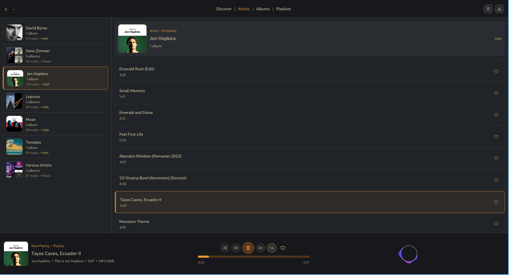

# Oryx

Native Rust music player built with `gpui`.

Oryx plays local files and includes Audius search and streaming. You can add more remote sources through user-installed TOML provider files.



## Requirements

- The Rust toolchain in `rust-toolchain.toml`
- `ffmpeg` and `ffprobe`
- `yt-dlp` for **Open Media**
- `cargo-packager` for release packages

## Development

```sh
cargo run
cargo test
```

Provider files belong in:

- Linux: `~/.config/oryx/providers/`
- macOS: `~/Library/Application Support/oryx/providers/`
- Windows: `%AppData%\oryx\providers\`

Set `ORYX_PROVIDER_DIR` to use another path. See [the provider guide](docs/provider-config.md).

## Packages

Build a local package with:

```sh
cargo install cargo-packager --locked
cargo packager --release --formats <dmg|appimage|deb|pacman|nsis>
```

Arch Linux users can install [`oryx-music-player-bin`](https://aur.archlinux.org/packages/oryx-music-player-bin).

## Policy

The code uses the [PolyForm Strict 1.0.0 license](LICENSE). Bug reports and feature requests are welcome, but pull requests need prior approval. See [CONTRIBUTING.md](CONTRIBUTING.md) and [TRADEMARKS.md](TRADEMARKS.md).
